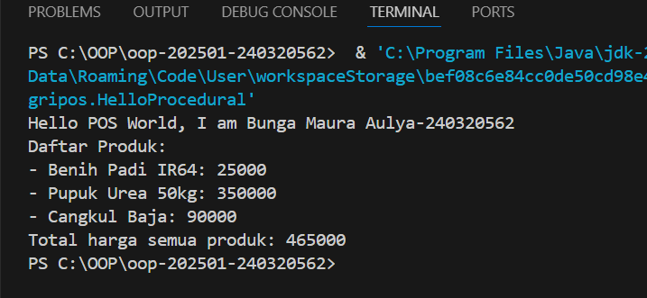
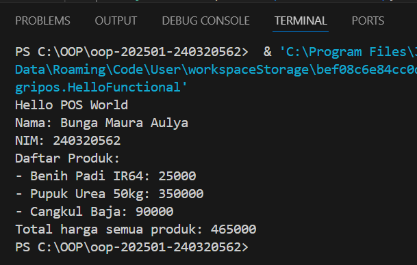

# Laporan Praktikum Minggu 1
Topik: ["Pengenalan Paradigma dan Setup Proyek"]

## Identitas
- Nama  : [Bunga Maura Aulya]
- NIM   : [240320562]
- Kelas : [3DSRA]

---

## Tujuan
- Mahasiswa mampu mendefinisikan paradigma prosedural, OOP, dan fungsional.
- Mahasiswa mampu membandingkan kelebihan dan keterbatasan tiap paradigma.
- Mahasiswa mampu memberikan contoh program sederhana untuk masing-masing paradigma.
- Mahasiswa aktif dalam diskusi kelas (bertanya, menjawab, memberi opini).

---

## Dasar Teori
Paradigma pemrograman adalah cara pandang dalam menyusun program:
- Prosedural: program dibangun sebagai rangkaian perintah (fungsi/prosedur).
- OOP (Object-Oriented Programming): program dibangun dari objek yang memiliki data (atribut) dan perilaku (method).
- Fungsional: program dipandang sebagai pemetaan fungsi matematika, lebih menekankan ekspresi dan transformasi data.
Dalam konteks Agri-POS, OOP membantu memodelkan entitas nyata seperti Produk, Transaksi, dan Pembayaran sebagai objek. Dengan demikian, sistem lebih mudah dikembangkan dan dipelihara.

---

## Langkah Praktikum
1. Setup Project
- Pastikan sudah menginstall JDK (Java Development Kit), IDE (misal: IntelliJ IDEA, VS Code, NetBeans), Git, PostgreSQL, dan JavaFX di komputer.
- Buat folder project oop-pos-<nim>.
- Inisialisasi repositori Git.
- Buat struktur awal src/main/java/com/upb/agripos/.
- Pastikan semua tools dapat berjalan (uji dengan membuat dan menjalankan program Java sederhana).

2. Program Sederhana dalam 3 Paradigma
- Prosedural: program untuk menghitung total harga dua produk.
- OOP: class Produk dengan atribut nama dan harga, buat minimal tiga objek, lalu hitung total.
- Fungsional: gunakan Stream atau lambda untuk menghitung total harga dari minimal tiga objek.

3. Commit dan Push
Commit dengan pesan: week1-setup-hello-pos.

---
``` java
## Kode Program
1. HelloProcedural

  System.out.println("Hello POS World, I am " +nama + "-" +nim);
        System.out.println("Daftar Produk: ");
        for (int i = 0; i < produk.length; i++){
            System.out.println("- " +produk[i] + ": " +harga[i]);
            total += harga[i];

2. HelloOOP

  public static void main(String[] args) {
        mahasiswa m = new mahasiswa("Bunga Maura Aulya", "240320562");
        m.sapa();
        Produk[] daftar = {
         new Produk("Benih Padi IR64", 25000),
         new Produk("Pupuk Urea 50kg", 350000),
         new Produk("Cangkul Baja", 90000)
        };
        int total = 0;

3. HelloFunctional

 System.out.println("Daftar Produk:");
        IntStream.range(0, produk.size())
            .forEach(i -> System.out.println("- " + produk.get(i) + ": " + harga.get(i)));
        int total = harga.stream().mapToInt(Integer::intValue).sum();
        System.out.println("Total harga semua produk: " + total);

---

## Hasil Eksekusi
(




)
---

## Analisis
1. Jelaskan bagaimana kode berjalan.  
- Program prosedural berjalan berurutan langkah demi langkah.
- Program OOP membagi program menjadi objek-objek yang punya data dan fungsi sendiri.
- Program fungsional lebih ringkas karena memanfaatkan fungsi bawaan untuk mengolah data tanpa banyak perulangan manual.

2. Apa perbedaan pendekatan minggu ini dibanding minggu sebelumnya.  
Karena ini merupakan minggu pertama, maka belum ada materi atau praktik sebelumnya yang bisa dijadikan perbandingan.

3. Kendala yang dihadapi dan cara mengatasinya.  
Kendala yang dihadapi pada minggu ini adalah masih perlu beradaptasi dengan lingkungan pemrograman Java dan memahami struktur dasar seperti class, method, serta sintaksnya. Cara mengatasinya yaitu dengan mempelajari kembali contoh kode sederhana, membaca dokumentasi Java, dan berlatih menulis serta menjalankan program secara bertahap hingga memahami alurnya dengan baik.

---

## Kesimpulan
Dengan memahami dasar pemrograman prosedural, fungsional, dan OOP, dapat disimpulkan bahwa penggunaan class dan object dalam OOP membuat program menjadi lebih terstruktur, modular, dan mudah dikembangkan, dibandingkan pendekatan prosedural yang berjalan secara berurutan tanpa pemisahan bagian logika program.


---

## Quiz
1. Apakah OOP selalu lebih baik dari prosedural? 

**Jawaban:** 
Pendekatan OOP tidak selalu lebih baik dari prosedural, karena keduanya memiliki keunggulan masing-masing. OOP lebih sesuai untuk program yang kompleks dan membutuhkan struktur yang terorganisir, sedangkan pendekatan prosedural lebih efektif digunakan pada program yang sederhana dan memiliki alur kerja yang langsung. Pemilihan pendekatan tergantung pada tujuan dan tingkat kompleksitas program yang dibuat.

2. Kapan functional programming lebih cocok digunakan dibanding OOP atau prosedural?

**Jawaban:**
Functional programming lebih cocok digunakan ketika program berfokus pada pengolahan data yang bersifat berulang, kompleks, atau memerlukan transformasi data secara efisien. Pendekatan ini sangat sesuai untuk kasus seperti analisis data, pemrosesan koleksi (list, array), dan operasi matematis, karena dapat menulis kode yang lebih singkat, mudah diuji, serta meminimalkan kesalahan akibat perubahan data (mutasi). Jadi, functional programming lebih unggul ketika dibutuhkan kode yang ringkas, bersifat deklaratif, dan berorientasi pada hasil, bukan pada langkah-langkah proses seperti pada OOP atau prosedural.

3. Bagaimana paradigma (prosedural, OOP, fungsional) memengaruhi maintainability dan scalability aplikasi? 

**Jawaban:**
Paradigma pemrograman sangat memengaruhi maintainability (kemudahan pemeliharaan) dan scalability (kemampuan aplikasi untuk dikembangkan). Pada paradigma prosedural, program biasanya lebih sederhana tetapi sulit dipelihara saat ukurannya membesar karena logika bercampur dalam satu alur. Paradigma OOP meningkatkan maintainability dan scalability karena kode dibagi menjadi class dan object, sehingga lebih mudah dikelola, diuji, serta dikembangkan tanpa mengubah keseluruhan program. Sementara itu, paradigma fungsional mendukung maintainability dengan cara meminimalkan efek samping dan membuat fungsi bersifat mandiri, sehingga mudah diuji dan diperluas. Dengan demikian, semakin baik struktur paradigma yang digunakan, semakin mudah aplikasi untuk dirawat dan dikembangkan di masa depan.

4. Mengapa OOP lebih cocok untuk mengembangkan aplikasi POS dibanding prosedural?

**Jawaban:**
OOP lebih cocok untuk mengembangkan aplikasi POS (Point of Sale) karena pendekatan ini memungkinkan program dibangun dari objek-objek yang mewakili entitas nyata, seperti Produk, Pelanggan, Transaksi, dan Kasir. Dengan OOP, setiap objek memiliki data dan perilaku sendiri, sehingga kode menjadi lebih terstruktur, mudah diubah, dan dapat digunakan kembali. Selain itu, OOP memudahkan pengembang menambahkan fitur baru—seperti laporan penjualan atau diskon—tanpa harus mengubah seluruh program. Sementara pada pendekatan prosedural, logika program cenderung bercampur, sehingga sulit dikelola jika aplikasi menjadi besar dan kompleks.

5. Bagaimana paradigma fungsional dapat membantu mengurangi kode berulang (boilerplate code)?

**Jawaban:**
Paradigma fungsional dapat membantu mengurangi kode berulang (boilerplate code) karena berfokus pada penggunaan fungsi-fungsi murni dan operasi deklaratif untuk memproses data. Dalam pemrograman fungsional, banyak tugas yang biasanya membutuhkan perulangan manual dapat digantikan dengan fungsi bawaan seperti map(), filter(), dan reduce(). Dengan begitu, programmer tidak perlu menulis kode berulang seperti inisialisasi variabel, perulangan, atau kondisi yang sama berkali-kali. Selain itu, fungsi dalam paradigma fungsional dapat digunakan kembali tanpa tergantung pada keadaan (state) tertentu, sehingga program menjadi lebih ringkas, mudah dibaca, dan lebih konsisten.
